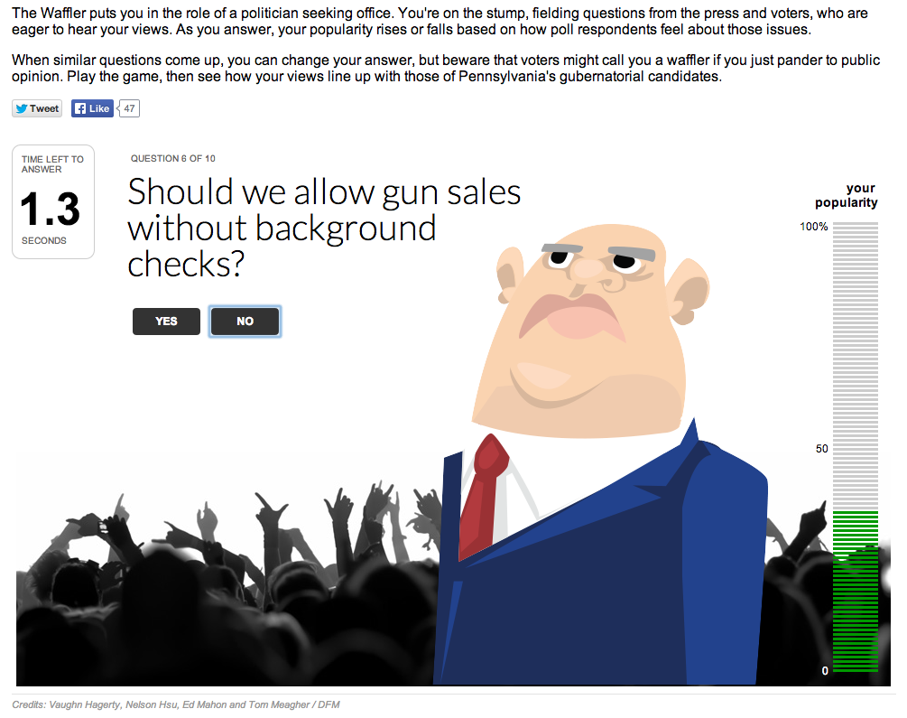

the-waffler
===========

What is this?
-------------

An app meant to sort of simulate the stress faced by a candidate in answering questions on topics in a live setting. Uses a timer to give the player five seconds to answer each of a series of questions. The user gains or loses support based on how the answers compare to real public opinion polling. At the end, the user can see how his or her responses compare with those of candidates, as well has what questions he or she "waffled" on.

The data is fed from a Google spreadsheet, such as this example:

<https://docs.google.com/a/digitalfirstmedia.com/spreadsheet/pub?key=0AmZLmP_PGBQKdGItd284XzR0ckRKWGNNWXdBZ3FPZlE&output=html>

See inline docs in [lib/js/waffler.js](lib/js/waffler.js) for more detailed information on how it works and what to customize.

This game ran on Digital First Media's sites in Pennsylvania for the 2014 gubernatorial primary. The original version was created as part of a hackathon organized by the Global Editors Network Editors' Lab. For more on that, see this post: <http://outsidethunderdome.com/2013/05/01/gaming-news/>

Credits
---------

Vaughn Hagerty, Nelson Hsu, Tom Meagher

Assumptions
-----------

* jQuery
* handlebars.js
* Google spreadsheets

What's in here?
---------------

The project contains the following folders and important files:

* ``index.html`` -- The app html and handlebars templates
* ``lib/js`` -- waffler.js: the main app; data.js: JSON object output from Google spreadsheet (see waffler.js notes); pa_candidates.js: helper objects used as lookups by the app
* ``lib/css`` -- Strangely enough, stylesheets
* ``lib/img`` -- images, such as candidate pics

License
----------

This code is available under the MIT license. For more information, please see the LICENSE file in this repo.

